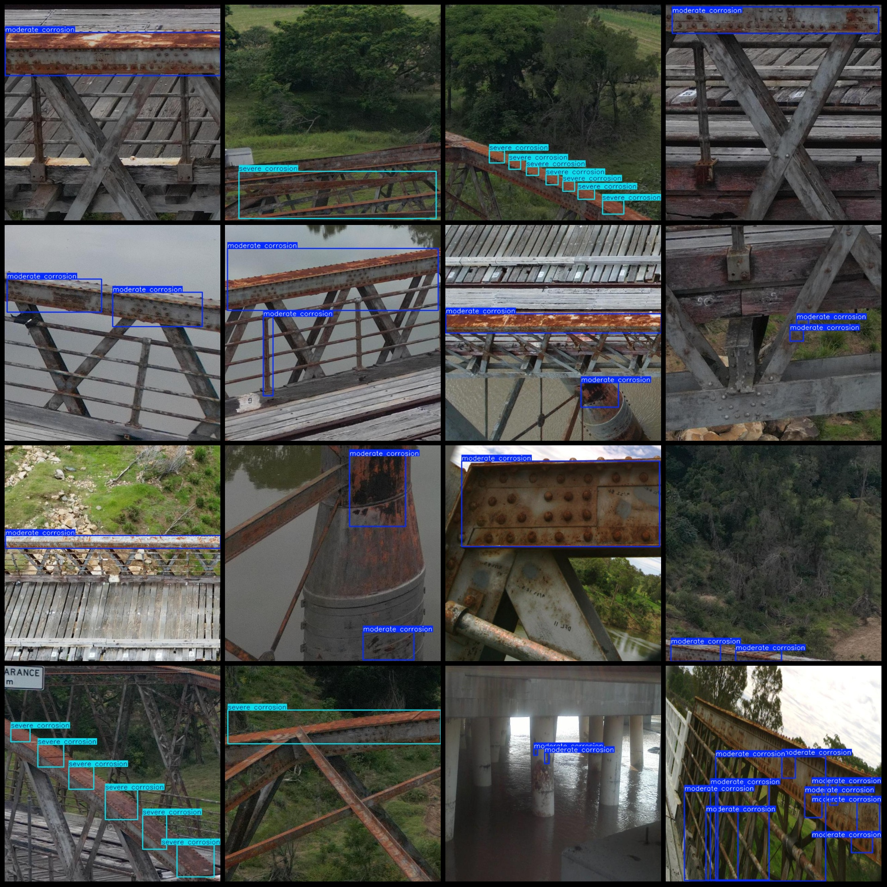
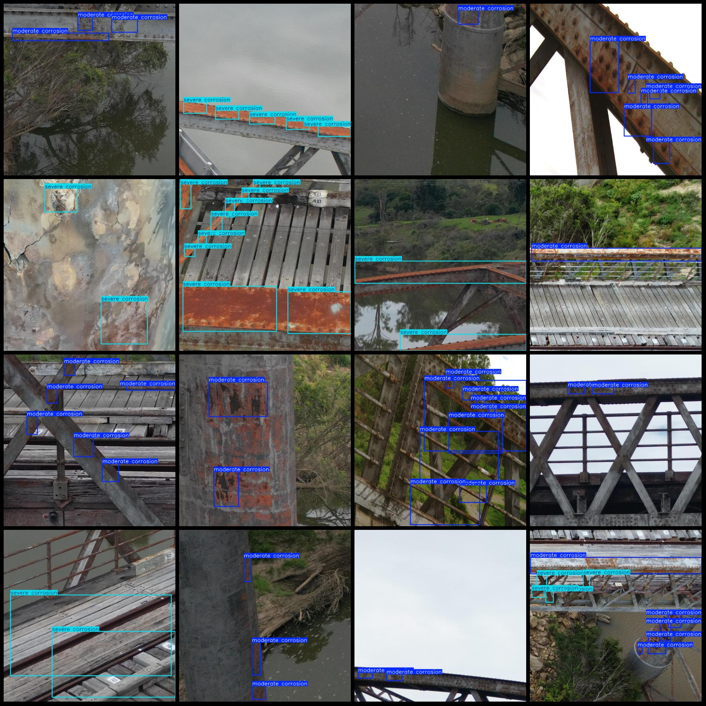

# Bridge Corrosion Severity Detection Dataset (VOC+YOLO) - 2370 Images, 2 Categories

**Dataset Format:** Pascal VOC format + YOLO format (txt file without split paths, only containing jpg images along with corresponding VOC-format xml files and yolo-format txt files)

**Number of Images (JPG Files):** 2370
**Number of Annotations (XML Files):** 2370
**Number of Annotations (Txt Files):** 2370
**Number of Annotation Categories:** 2
**Annotation Category Names (Note that the order in the yolo-format classes does not match this, but is based on the labels folder's classes.txt):** ["moderate corrosion", "severe corrosion"]

**Box Count per Category:**
- Moderate corrosion Box count = 4559
- Severe corrosion Box count = 2981
Total Box Count = 7540

**Image Resolution:** 640x640

**Annotation Tool:** labelImg
**Annotation Rules:** Draw bounding boxes for categories

**Important Notes:** None available

**Special Declaration:** This dataset does not guarantee the accuracy of models trained on it or weight files.

**Image Preview:**
## Images

Here is a pay link on Stripe ( https://buy.stripe.com/3cs8yP7sY87d0vu9AB ). Please contact me lonlonago@foxmail.com after funding $89, and I will send you a complete data files , thank you!

